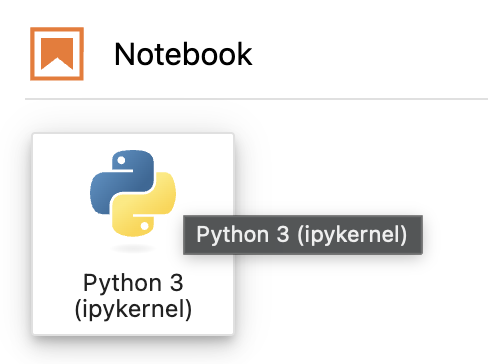
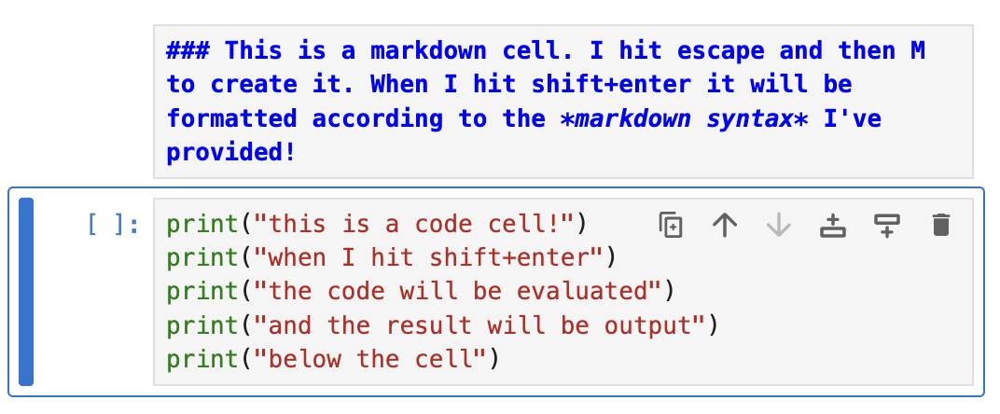

## Environment Setup

The examples so far have run right in the browser. Once we get into CSV
parsing, JSON, working with APIs, and scraping with BeautifulSoup, we'll
need a real local Python environment instead — this page covers getting
that set up once, ahead of time.

### Installing Anaconda from the command line

[Anaconda](https://www.anaconda.com/download) is a Python distribution
that bundles the interpreter, common data science packages, and `conda`,
a tool for managing isolated environments.

1. Download the command-line installer for your OS from
   [anaconda.com/download](https://www.anaconda.com/download) (choose the
   "Command Line Installer," not the graphical one).
2. Run the installer from a terminal:

   **macOS / Linux:**
   ```bash
   bash ~/Downloads/Anaconda3-*.sh
   ```
   Follow the prompts (accept the license, confirm the install location,
   and say yes when asked whether to run `conda init`).

   **Windows:** run the downloaded `.exe` and follow the setup wizard,
   then open "Anaconda Prompt" from the Start menu for the rest of these
   steps.

3. Close and reopen your terminal so the changes take effect, then
   confirm the install worked:

   ```bash
   conda --version
   ```

   This should print a version number, like `conda 24.x.x`.

### Creating the "learning" environment

A conda **environment** is an isolated Python installation with its own
packages, so work in one project can't accidentally break another. Create
one called `learning`:

```bash
conda create --name learning python=3.12
```

Type `y` when prompted to confirm. Then activate it:

```bash
conda activate learning
```

Your terminal prompt should now show `(learning)` at the start of the
line, confirming the environment is active. From here on, any `python`,
`conda install`, or `pip install` command run in this terminal applies
only to the `learning` environment.

### Installing the libraries we'll need

With `learning` activated, install everything in one go:

```bash
conda install jupyterlab numpy pandas bs4
```

Type `y` when prompted to confirm. That installs:

- **jupyterlab** — the notebook interface we'll use to follow along
- **numpy** — numerical arrays and math operations
- **pandas** — tabular data (reading CSVs, working with rows/columns)
- **bs4** (Beautiful Soup) — parsing HTML for web scraping

Once it finishes, launch JupyterLab from within the activated environment:

```bash
jupyter lab
```

This opens JupyterLab in your browser, pointed at whatever directory you
ran the command from.

### Using JupyterLab to follow along

**Create a notebook.** In JupyterLab, go to File → New → Notebook, (or select the New Python3 Notebook option from the launcher as pictured) and
pick the Python 3 kernel when prompted. This gives you a new `.ipynb`
file with a single empty cell.



**Cells are the unit of work.** A notebook is a stack of cells you write
and run one at a time, in whatever order you like. There are two kinds:

- **Code cells** — Python code. Run one with **Shift+Enter** (runs the
  cell and moves to/creates the next one) or **Ctrl+Enter** (runs it in
  place, without moving on).
- **Markdown cells** — plain-text notes, headers, etc. Turn the current
  cell into one with `Esc` then `M`.



**Write and run each example as its own cell.** Type a line of code (say,
`print("Hello, world!")`) into a cell and run it (shift or ctrl and enter)— the output appears
directly underneath that same cell. Move to the next cell for the next
example, and so on down the notebook.

**Save your work.** Ctrl+S saves the notebook file, including whatever
output is currently displayed under each cell.
